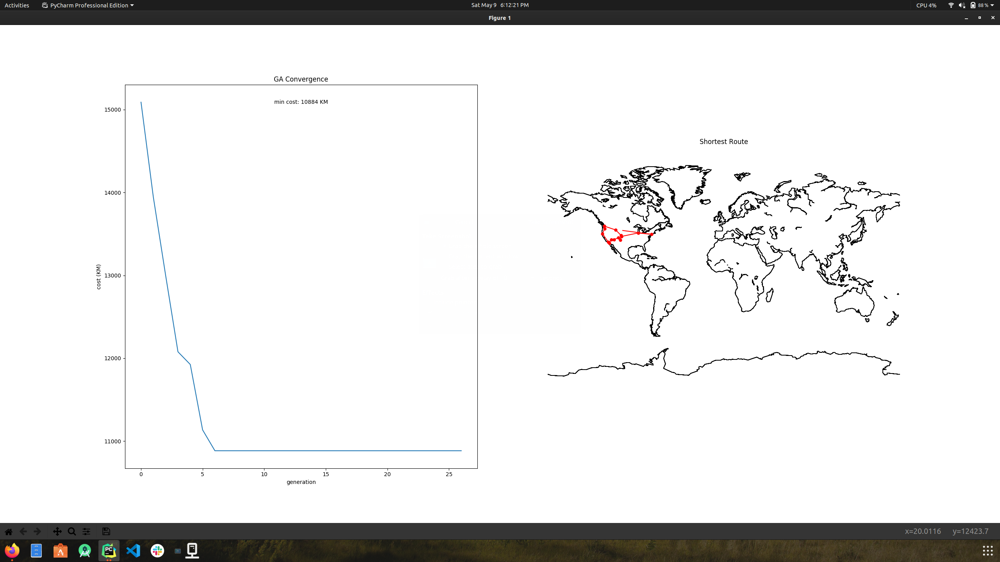
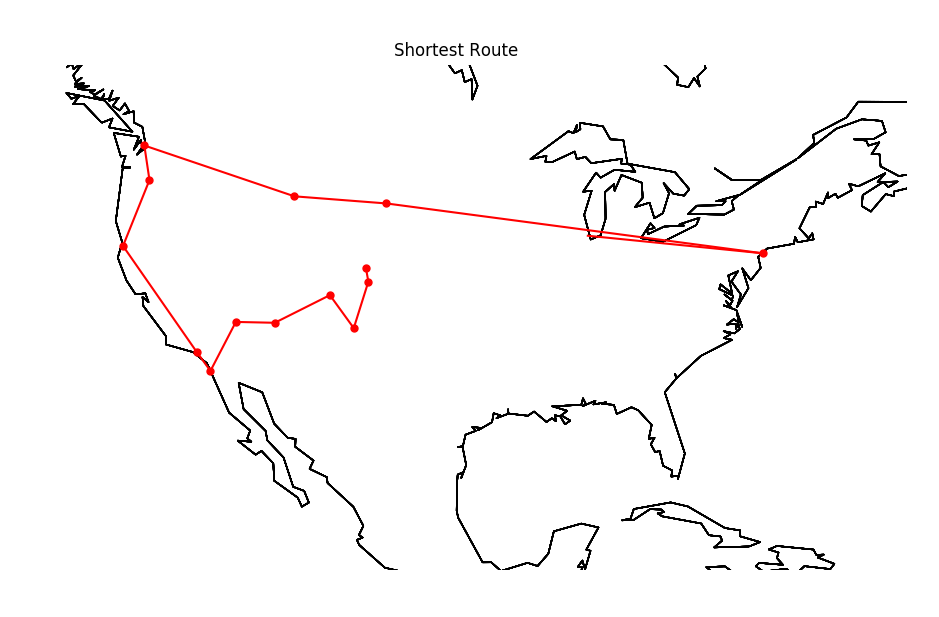
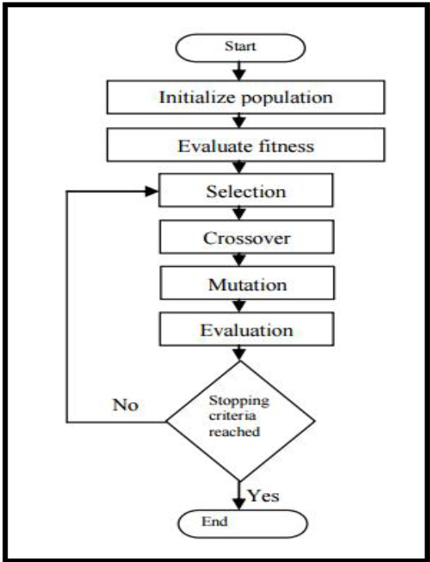
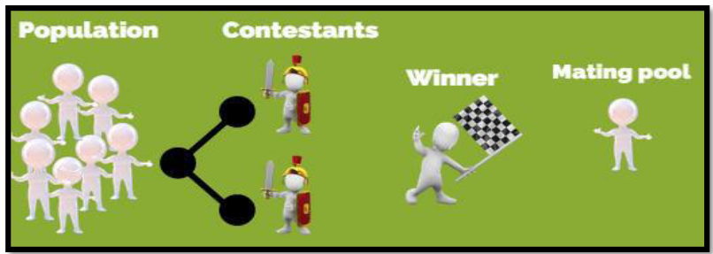

## <center> CS3120 - Machine Learning Final Project</center>
### <center>Travelling Salesman Problem (TSP) - Genetic Algorithm</center>
##### <center> Nick Gagliardi </center>

---
**To run the program:**
```
cd src
python main.py -v 1 --pop_size 500 --tourn_size 50 --mut_rate 0.02 --n_gen 20 --cities_fn '../data/cities.csv'
```

---
#### I. Description of the Problem
1. *What is the project about?*

    This project started as an idea to play around with reinforcement learning as well as the Travelling Salesman Problem (TSP). Slowly it turned into finding the most efficient route for my fiance and I to take on a road trip. While a majorirty of the code is based on Mr. lccasagrande's implementation, documentation and adjustments were made to answer my overall objective. This program did show that the shortest route was roughly 10,000km, where mapquest resulted in about 15,000km. I am tempted to try and find an average of both over many interations, but was unable to find the time to do so before this projects deadline. 
    
    A breif description of the Travelling Salesman Problem from Wikipedia, "Given a list of cities and the distances between each pair of cities, what is the shortest possible route that visits each city and returns to the origin city?" It is an NP-hard problem in combinatorial optimization, important in operations research and theoretical computer science.
    
    Utilizing a Genetic Algorithm the program will attempted to find the shortest route between 15 American locations:
    - Denver, CO
    - Colorado Springs, CO
    - Telluride, CO
    - Las Vegas, NV
    - Grand Canyon, AZ
    - Yellowstone National Park, WY
    - Mount Rushmore, SD
    - Seattle, WA
    - Redwood National Park, CA
    - San Diego, CA
    - Los Angeles, CA
    - Mount Hood National Forest, OR
    - Santa Fe, NM
    - Chicago, IL
    - New York, NY
    
    
    The output is two graphs, one showing a comparison of the cost (distance in KM) and number of generations. The other graph is a rough estimation of the shortest route, with the coastline of the globel in the foreground. 
    
    
    
    
---
#### II. Implementation
1. **`./src/main.py`**
    - The main purpose of main.py is to parse the input entered by the user (See the beginning of ths file on how ***to run the program***)
    - **`def run(args)`:**
        - `genes` 
            - passes args.cities_fn to the utils class
        - `history` 
            - saves the individual's from the population
    ```python
    import utils
    import random
    import argparse
    import tsp_ga as ga
    from datetime import datetime


    def run(args):
        genes = utils.get_genes_from(args.cities_fn)

        if args.verbose:
            print("-- Running Model with {} cities --".format(len(genes)))

        history = ga.run_ga(genes, args.pop_size, args.n_gen,
                            args.tourn_size, args.mut_rate, args.verbose)

        if args.verbose:
            print("-- Drawing Route --")

        utils.plot(history['cost'], history['route'])

        if args.verbose:
            print("-- Done --")
    ```
    
    
    - **`__name__ == "__main__"`**:
        - `parser`
            - parses the arguments entered by the user when trying to run the program.
    
    ```python

    if __name__ == "__main__":
        parser = argparse.ArgumentParser()

        parser.add_argument('-v', '--verbose', type=int, default=1)
        parser.add_argument('--pop_size', type=int, default=500, help='Population size')
        parser.add_argument('--tourn_size', type=int, default=50, help='Tournament size')
        parser.add_argument('--mut_rate', type=float, default=0.02, help='Mutation rate')
        parser.add_argument('--n_gen', type=int, default=20, help='Number of equal generations before stopping')
        parser.add_argument('--cities_fn', type=str, default="data/cities.csv",
                            help='Data containing the geographical coordinates of cities')

        random.seed(datetime.now())
        args = parser.parse_args()

        if args.tourn_size > args.pop_size:
            raise argparse.ArgumentTypeError('Tournament size cannot be bigger than population size.')

        run(args)
    ```
    
    
2. **`./src/tsp_ga.py`**
    - Selection Technique - Tournament Selection
        - Initialized the population with the tournament size = 50
        - Save every individual for the tournament to find the fittest
        - Find the fittest individual according to the the distance between the cities in kilometers (because miles make no sense anywhere else in the world).
    ```python
    from sys import maxsize
    from time import time
    from random import random, randint, sample
    from haversine import haversine


    class Gene:  # City
        # keep distances from cities saved in a table to improve execution time.
        __distances_table = {}

        def __init__(self, name, lat, lng):
            self.name = name
            self.lat = lat
            self.lng = lng

        def get_distance_to(self, dest):
            origin = (self.lat, self.lng)
            dest = (dest.lat, dest.lng)

            forward_key = origin + dest
            backward_key = dest + origin

            if forward_key in Gene.__distances_table:
                return Gene.__distances_table[forward_key]

            if backward_key in Gene.__distances_table:
                return Gene.__distances_table[backward_key]

            dist = int(haversine(origin, dest))
            Gene.__distances_table[forward_key] = dist

            return dist
    ```
    
    ```python
    class Individual:  # Route: possible solution to TSP
        def __init__(self, genes):
            assert(len(genes) > 3)
            self.genes = genes
            self.__reset_params()

        def swap(self, gene_1, gene_2):
            self.genes[0]
            a, b = self.genes.index(gene_1), self.genes.index(gene_2)
            self.genes[b], self.genes[a] = self.genes[a], self.genes[b]
            self.__reset_params()

        def add(self, gene):
            self.genes.append(gene)
            self.__reset_params()

        def fitness(self):
            if self.__fitness == 0:
                self.__fitness = 1 / self.travel_cost  # Normalize travel cost
            return self.__fitness

        def travel_cost(self):  # Get total travelling cost
            if self.__travel_cost == 0:
                for i in range(len(self.genes)):
                    origin = self.genes[i]
                    if i == len(self.genes) - 1:
                        dest = self.genes[0]
                    else:
                        dest = self.genes[i+1]

                    self.__travel_cost += origin.get_distance_to(dest)

            return self.__travel_cost

        def __reset_params(self):
            self.__travel_cost = 0
            self.__fitness = 0
    ```
    
    ```python
    class Population:  # Population of individuals
        def __init__(self, individuals):
            self.individuals = individuals

        def gen_individuals(sz, genes):
            individuals = []
            for _ in range(sz):
                individuals.append(Individual(sample(genes, len(genes))))
            return Population(individuals)

        def add(self, route):
            self.individuals.append(route)

        def rmv(self, route):
            self.individuals.remove(route)

        def get_fittest(self):
            fittest = self.individuals[0]
            for route in self.individuals:
                if route.fitness > fittest.fitness:
                    fittest = route

            return fittest
    ```

    - **Elitism Selection:**
        - In the beginning, the best individuals are copied from the current generation and then the   evolution proceeds (crossover, mutation).
        - This prevents the loss of the best solution that was reached, so elitism helps in the rapid  improvement  of  the performance of the GA(arxiv.org).
    - **Crossover (Recombination):**
        - This process takes two parents (chromosomes) to create a new offspring by switching segments of the parent genes.
        - It is more likely that the new offspring (children) will  contain  good  parts  of  their parents, and consequently perform better as compared to their ancestors. 
        - A number of different crossover  operators  can  be  used  in  GAs(Kaya  &  Uyar,  2011), beginning  with  one-point  crossover  and  two-point  crossover,  then evolving  into  several  techniques  to  accommodate  some  situations.
    - **Mutation:**
        - This is where there is a cahnge or a switch between specific genes within a single chromosome to create chromosomes that provide a new solution for the next generation, with the aim of obtaining the best possible solutions, and thus introduce a certain level of diversity to the population.
    ```python
    def evolve(pop, tourn_size, mut_rate):
        new_generation = Population([])
        pop_size = len(pop.individuals)
        elitism_num = pop_size // 2

        # Elitism
        for _ in range(elitism_num):
            fittest = pop.get_fittest()
            new_generation.add(fittest)
            pop.rmv(fittest)

        # Crossover
        for _ in range(elitism_num, pop_size):
            parent_1 = selection(new_generation, tourn_size)
            parent_2 = selection(new_generation, tourn_size)
            child = crossover(parent_1, parent_2)
            new_generation.add(child)

        # Mutation
        for i in range(elitism_num, pop_size):
            mutate(new_generation.individuals[i], mut_rate)

        return new_generation
    ```


    ```python
    def crossover(parent_1, parent_2):
        def fill_with_parent1_genes(child, parent, genes_n):
            start_at = randint(0, len(parent.genes)-genes_n-1)
            finish_at = start_at + genes_n
            for i in range(start_at, finish_at):
                child.genes[i] = parent_1.genes[i]

        def fill_with_parent2_genes(child, parent):
            j = 0
            for i in range(0, len(parent.genes)):
                if child.genes[i] == None:
                    while parent.genes[j] in child.genes:
                        j += 1
                    child.genes[i] = parent.genes[j]
                    j += 1

        genes_n = len(parent_1.genes)
        child = Individual([None for _ in range(genes_n)])
        fill_with_parent1_genes(child, parent_1, genes_n // 2)
        fill_with_parent2_genes(child, parent_2)

        return child
    ```


    ```python
    def mutate(individual, rate):
        for _ in range(len(individual.genes)):
            if random() < rate:
                sel_genes = sample(individual.genes, 2)
                individual.swap(sel_genes[0], sel_genes[1])
    ```


    ```python
    def selection(population, competitors_n):
        return Population(sample(population.individuals, competitors_n)).get_fittest()
    ```
    
    ```python
    def run_ga(genes, pop_size, n_gen, tourn_size, mut_rate, verbose=1):
        population = Population.gen_individuals(pop_size, genes)
        history = {'cost': [population.get_fittest().travel_cost]}
        counter, generations, min_cost = 0, 0, maxsize

        if verbose:
            print("-- Genetic Algorithm -- Initiating evolution...")

        start_time = time()
        while counter < n_gen:
            population = evolve(population, tourn_size, mut_rate)
            cost = population.get_fittest().travel_cost

            if cost < min_cost:
                counter, min_cost = 0, cost
            else:
                counter += 1

            generations += 1
            history['cost'].append(cost)

        total_time = round(time() - start_time, 6)

        if verbose:
            print("-- Genetic Algorithm -- Evolution finished after {} generations in {} s".format(generations, total_time))
            print("-- Genetic Algorithm -- Minimum travelling cost {} KM".format(min_cost))

        history['generations'] = generations
        history['total_time'] = total_time
        history['route'] = population.get_fittest()

        return history
    ```
    
    
3. **`./src/utils.py`**
    - This section of code is for displaying the output of the program.
    - Basemap is required to display the output correctly
    
    ```python
    import matplotlib.pyplot as plt
    import tsp_ga as ga
    import pandas as pd
    from random import sample
    from mpl_toolkits.basemap import Basemap


    def get_genes_from(fn, sample_n=0):
        df = pd.read_csv(fn)
        genes = [ga.Gene(row['city'], row['latitude'], row['longitude'])
                 for _, row in df.iterrows()]

        return genes if sample_n <= 0 else sample(genes, sample_n)
    ```

    ```python
    def plot(costs, individual, save_to=None):
        plt.figure(1)
        plt.subplot(121)
        plot_ga_convergence(costs)

        plt.subplot(122)
        plot_route(individual)

        if save_to is not None:
            plt.savefig(save_to)
            plt.close()
        else:
            plt.show()
    ```
    
    ```python
    def plot_ga_convergence(costs):
        x = range(len(costs))
        plt.title("GA Convergence")
        plt.xlabel('generation')
        plt.ylabel('cost (KM)')
        plt.text(x[len(x) // 2], costs[0], 'min cost: {} KM'.format(costs[-1]), ha='center', va='center')
        plt.plot(x, costs, '-')
    ```

    ```python
    def plot_route(individual):
        m = Basemap(projection='lcc', resolution=None,
                    width=5E6, height=5E6,
                    lat_0=-15, lon_0=-56)

        plt.axis('off')
        plt.title("Shortest Route")

        for i in range(0, len(individual.genes)):
            x, y = m(individual.genes[i].lng, individual.genes[i].lat)

            plt.plot(x, y, 'ok', c='r', markersize=5)
            if i == len(individual.genes) - 1:
                x2, y2 = m(individual.genes[0].lng, individual.genes[0].lat)
            else:
                x2, y2 = m(individual.genes[i+1].lng, individual.genes[i+1].lat)

            plt.plot([x, x2], [y, y2], 'k-', c='r')
            m = Basemap(projection='mill')
            m.drawcoastlines()    
    ```
    
4. **`./data/cities.csv`**
    - csv file that holds the name/latitude/longitude for each city
    - 15 cities
    ```
    city,latitude,longitude
    Denver,39.7420,-104.9915
    Colorado Springs,38.8461,-104.8006
    Telluride,37.9375,-107.8123
    Las Vegas,36.1146,-115.1728
    Grand Canyon,36.0565,-112.1251
    Yellowstone National Park,44.4237,-110.5885
    Mount Rushmore,43.9686,-103.3818
    Seattle,47.6080,-122.3352
    Redwood National Park,41.2131,-124.0046
    San Diego,32.7157,-117.1610
    Los Angeles,34.05223,-118.24368
    Mount Hood National Forest,45.454350,-121.933136
    Santa Fe,35.691544,-105.944183
    Chicago,41.881832,-87.623177
    New York City,40.730610,-73.935242
    ```
---
#### III. Libraries/Packages
   ##### REQUIRED TO RUN THE PROGRAM: 
   1. ***basemap***
       - Installing this package can be a pain in the butt depending on your system.
       - If you run into any issues (like I did), follow this link's tutorial.
           - https://peak5390.wordpress.com/2012/12/08/matplotlib-basemap-tutorial-installing-matplotlib-and-basemap/
       - Side note:
           - I believe some of issues I had installing this package was due to the fact that it doesnt always play nice with virtual environments.
   2. ***haversine***
       - `pip3 install haversine`
   3. ***matplotlib***
       -  `pip3 install matplotlib`
   4. ***pandas***
       - `pip3 install pandas`
   5. ***utils***
       - `pip3 install utils`
   6. ***random***
       - `pip3 install random`
   7. ***argparse***
       - `pip3 install argparse`
 
---
#### IV. Genetic Algorithm (GA)
The main reason for selecting this particular algorithm was the fact that it was not really covered in our Machine Learning class. I was already curious about GAs, having already seen videos of race car games being played by AI based on GAs. So while this particular implementation is rather simple, I thought it was a good way to start. Furthermore, I tried to maintain the idea that this project was for expanding my base knowledge and to try something new.

Now a genetic algorithm is a heuristic search method used in artificial intelligent and computing. It is used for finding optimized solutions to search problems based on the theory of natural selection and evolutionary biology. Genetic algorithms are excellent for searching through large and complex data sets. They are considered capable of finding reasonable solutions to complex issues as they are highly capable of solving unconstrained and constrained optimization issues (Techopedia).

In a genetic algorithm, a population of candidate solutions (also called individuals, creatues, or phenotypes) to an optimization problem evolved toward better solutions (wikipedia). Each of these 'individual' solutions has a set of properties that can be manipulated or adjusted. Then by Evolving from a population of randomly generated individuals, in an iterative process, with the population in each iteration called a *generation*. After each generation is generated the fitness of every individual in the population is evaluated through a fitness function. In my case, the project implementes a type of *tournament* style based on the distance in KM. The individuals that are the most successful are selected from the current population, and each individual's attributes are then modified, or altered randomly, to form the next generation. Usually, GAs will terminate when either a max number of generations is reached, or a predetermined fitness level is achieved for the population.

The aim of this program is to find a more efficient solution than just brute force searching for an answer. While this particular algorithm is simple, understanding the behavior is difficult to understand. I know that I struggled with the way GAs generate a solutions. 



However, genetic algorithms really only require a few basic steps:
   1. ***Initialization:***
       - Depending on the problem trying to be solved, the population size can vary. Often, the original population will be generated randomly, thus allowing for a wider range of possible mutations.
   2. ***Selection:***
       - After each generations a portion of the existing population is selected to start the next generation.
   3. ***Genetic Operators:***
       - These processes ultimately result in the next generation population of 'chromosomes' that is different from the initial generation.
       - The average fitness will have increase through this process for the overall population, since only the best individuals from the first generation are selected along with a small porportion of less fit solutions.
       - These less fit solutions ensure genetic diversity within the genetic pool of the parents and therefore ensure the genetic diversity of the subsequent generation of children.
   4. ***Termination:***
       - There are various ways to terminate once a condition has been reached. Wikipedia lists the most common:
           1. A solution is found that satisfies minimum criteria.
           2. Fixed number of generations reached
           3. Allocated budget (computation time/money) reached
           4. The highest ranking solution's fitness is reaching or has reached a plateau such that successive iterations are no longer producing better results.
           5. Manual inspection
           6. Combinations of the above

Limitations (Medium)
   1. Fitness Modelling is hard
   2. Dysfunctional for complex problems
   3. Unclear stop criteria
   4. Local optimum traps
   5. Limited use Cases 

---
#### V. Analysis of Performance
The model cold be improved by adding specifing start location, rather than being just random. However the overall performance was improved by keeping distances from different cities in a table, thus improving the execution time (see `class Gene` in `./src/tsp_ga.py`). 

Also implemented to improve performance is **Elitism Selection**, which is when the best individuals are selected from the current generation and then slightly altered (evolution, crossover, mutation, etc), then added to the next generation. Overtime this will gradually improve the results i.e. performance. See `def evolve()` in `./src/tsp_ga.py`. 



---
#### VI. Final Notes
1. While the most of the code is not my own, I used this project to study something I found interesting. I did change the cities as well as some of the verbage (was in spanish originally)
2. 
---
#### VII. References
   1. **lccasagrande**
        - https://github.com/lccasagrande/TSP-GA
        - Majority of the code is based on Mr. lccasagrande's implementation.
   2. **Hands-On Machine Learning with Scikit-Learn and TensorFlow**
        - Various concepts of Neural Networks, evolutionary algorithms (EA).
   3. **City Locations**
        - https://www.latlong.net/place/
        - Used for all the latitude and Longitude values for each city.
   4. **Multi-stop Route Planner and Optimization Tools - Mapquest**
        - https://www.mapquest.com/routeplanner
        - Base Route = 15638 km
   5. **Techopedia**
        - https://www.techopedia.com/definition/17137/genetic-algorithm
        - Used to define Genetic Algorithms
   6. **Medium**
        - https://medium.com/@arbistarkillerllaveshi/genetic-algorithms-summary-limitations-3da8df3e1138
        - Used to describe the limitations of GA
   7. **Genetic Algorithms-Overview, Limitations and Solutions**
        - https://www.krishisanskriti.org/vol_image/04Jul201511073305%20%20%20%20%20%20%20Dayanand%205%20%20%20%20%20%20%20%20%20%20%20%20%20%20%20%20%20%20329-333.pdf
   8. **Matplotlib Basemap Tutorial: Installing matplotlib and Basemap**
        - https://peak5390.wordpress.com/2012/12/08/matplotlib-basemap-tutorial-installing-matplotlib-and-basemap/
   9. **Arxiv.org**
        - https://arxiv.org/pdf/1801.02827.pdf
        - Used to explain different performance selections.